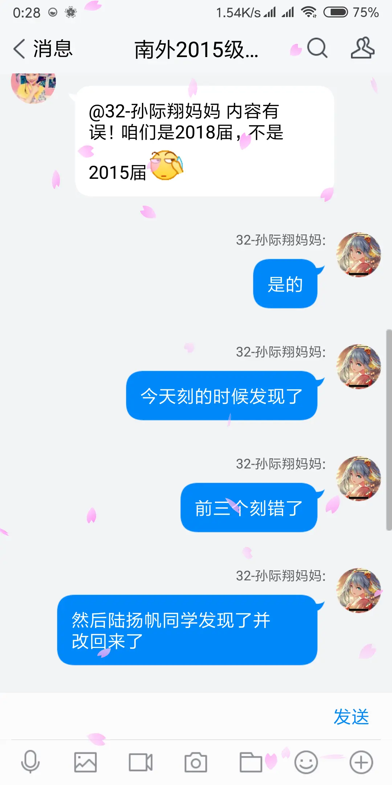

# 群的起源

> 这个群是18年建立的（准确来说是2018.06.30 14:58），到现在（2021年）已经整整3年了。
>
> 在此群建立之前，同样还是这么一撮人，天天占用公共信道（十班童鞋群群）聊天，把班群搞得乌烟瘴气，现在想想真是抱歉
>
> 说来也奇妙，群建立的时候我们都已经初中毕业了，明明已经错过了天天都能线下见面的时期，但它还是发展起来了
>
> 那么这个群当初为什么会被建立呢

2018年6月底，刚刚初中毕业了的我们正在为毕业晚会做准备。当时，孙际翔（以下简称雪涙）提出了准备镭刻充电宝的提案，而其购买需要去小米之家，于是出主意的雪涙，负责礼品的熊珂仪（以下简称学姐），和住的离小米之家近的陆扬帆（以下简称西格玛）便开始了讨论。

学姐需要负责构思镭刻的句子：

西格玛需要进行采购，并担任吐槽役：

而一直在双线聊天的雪涙，终于受不了了不停得将一方的聊天记录发送给另一方，拉了一个讨论组。至此，本群正式创建

~~所以这里得插一嘴，**本群其实是雪涙创建的**！不过为什么现在变成了学姐当群主呢？~~

机智的朋友已经看出来了，我们的学姐把`级`和`届`弄混了，导致前三个充电宝被打成了2015届，而我们实际上是2015级或者2018届，好在被西格玛在小米之家察觉到，并改过来了

而这就是“学姐”这个称呼的由来，毕竟她是15届的学姐嘛

其实区分`级`和`届`很简单，因为届是“到”的意思，所以2018届就是2018年到达初中的终点。

~~那如何记住届是“到”的意思呢？只要记住*届かない恋*就行了~~

这点也在家长群里被指正出来了

